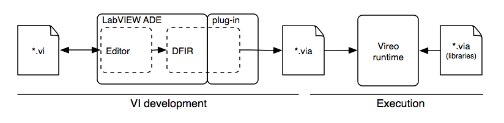

<!--
Copyright (c) 2020 National Instruments
SPDX-License-Identifier: MIT
-->

## The Big Picture
Vireo is a runtime engine. That means it works behind the scenes when a  program it enables is run. It is not an ADE, there may be no window, no panel, no diagram. When a program is run, the inputs and outputs may be simple stdin/stdout streams, network I/O or raw digital I/O. Much like the standard C library, Vireo can be statically linked in a stand alone executable or built and used as a shared library.  The programs that Vireo runs are loaded from a low level textual data flow language called VI-Assembly ( *.via).  Parsing the VIA files is treated as the decoder portion of a codec so other formats can be supported. The development roadmap includes support for a more compact bytecode format (*.vib).  While it is easy to write simple tests by hand, the preferred approach is to generate them directly from LabVIEW diagrams. The LabVIEW for LEGO Mindstorms module is the first module to include this support.

The  Vireo runtime consists of subsystems to load user programs, connect them to functions provided by the host, and the execute them. Functionality is partitioned into the following primary parts:

__Type Manager__ - The type manager types, and instances of data including default values for each type. It has a dictionary to map names to defined types. Since types are a form of data, the concept of type and data along with the underlying allocation mechanism are tightly interwoven.

__Functions__ - The set of functions for math, IO, array, etc. they can be implemented in C++ or VI-assembly. The set of functions provided by the host can be statically linked or dynamically loaded by the runtime. Many of the core functions that make up the TypeManager and scheduler subsystems are registered as functions.

__Scheduler__ - The scheduler runs code according to LabVIEW’s parallel data-flow model of execution.

__Dynamic Optimization__ - The reference runtime is designed to be a good foundation for experimentation with dynamic optimization. Programs are executed using a technique called threaded code, which efficiently links native functions into threads of code. Its fast, but VI made of small operations will be slower than VI compiled to native code since parameters are used in individual operations are passed through memory, not registers.  Vireo is designed to make it easy for a specific platform to instrument the code it loads and to subsequently compile select portions of code when metrics indicate there is sufficient merit to do so.

##Example 1: Hello World
LabVIEW is a graphical language, so one could suggest that the LabVIEW Hello World program is simply a Panel with Label that says "Hello World". That's a plausible solution and would make it the simplest version on Wikipedia's list of Hello World programs. However, the spirit of the task is to generate output when executed that can then be used as input to a second program. For Linux/Unix/Windows, this is done by writing to the output stream of the process. Thus, when the program is run, it gets to say hello to the machine as well as the to the human. Like those examples, these use simple stdio.
###VI Assembly (*.via) files and regular VI files (*.vi)
When a user develops a program (e.g. a diagram) with LabVIEW, the work is saved as a VirtualInstrument (.vi) file. These files are centered around the elements drawn by the user.  When a VI is run using  the traditional desktop workflow LabVIEW analyzes the high-level diagram and partitions it into sections of code that can be run by the host processor and it determines what memory will be needed for variables. The result of this analysis is directly turned into native code using LLVM for standard CPUs, or turned into VHDL for targeting FPGAs. Since the VI file describes high-level graphical objects, it cannot be directly loaded by Vireo. Instead, to target the Vireo runtime, the result of LabVIEW analysis is captured in a VI assembly file (.via).
As an assembly file, VIA source is low-level. It has no graphical description elements and it is not commonly written by hand. It includes primitive operations like branching not directly accessible at the graphical diagram level.  Here is a sample program:

~~~
define (HelloWorld dv(.VirtualInstrument (
    c(
        e(dv(String 'hello, world') variable1)
    )
    clump(1
        Print(variable1)
    )
) ) )
enqueue (HelloWorld)
~~~
The HelloWorld.via file is a script made up of commands. In this case there are two commands. The first command defines a VI, and the second one enqueues the VI onto the Vireo run queue. The VI is made of the following basic parts.
* A Name ‘HelloWorld’
* A Data-space (its a cluster) with one variable named variable1. The variable has the default value 'hello, world'
* One Clump of code with a fire count of 1 ( more on that later)
* One instruction that will call the Print function when executed.
* Once the VI is enqueued, the execution system in Vireo will execute instructions in all active clumps until there are no more to execute. The enqueue command is very similar to what LabVIEW does when a user presses the go button.

A VIA file can be run directly from a command line using Vireo's egg shell (esh). The launch time is similar to other command line tools like “ls”
~~~
# run from your unix/linux/windows prompt
$esh HelloWorld.via
hello, world

# make sure it runs fast
$time esh HelloWorld.via
hello, world

real	0m0.005s
user	0m0.003s
sys	0m0.002s
~~~

## Next Steps
* [Introduction](index.html)
* [Some more simple type examples](md_dox__intro_type_examples.html)
* [Some array type examples](md_dox__intro_array_examples.html)
* [VIs with parallel execution](md_dox__intro_parallel_clump_examples.html)
* [The TypeManager](md_dox__type_manager.html)
